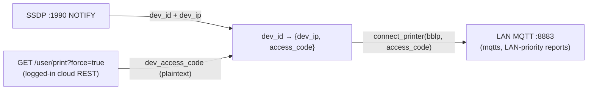

### 6.4. Local printer connection (LAN)

| Symbol | Signature |
|--------|-----------|
| `bambu_network_connect_printer` | `int(void*, std::string dev_id, std::string dev_ip, std::string username, std::string password, bool use_ssl)` |
| `bambu_network_disconnect_printer` | `int(void*)` |
| `bambu_network_send_message_to_printer` | `int(void*, std::string dev_id, std::string json_str, int qos, int flag)` |
| `bambu_network_update_cert` | `int(void* agent)` — `func_check_cert`; refreshes certificates at runtime |
| `bambu_network_install_device_cert` | `void(void*, std::string dev_id, bool lan_only)` |
| `bambu_network_start_discovery` | `bool(void*, bool start, bool sending)` — SSDP |

#### 6.4.1. Where the LAN credentials come from (incl. cloud-paired printers)

A LAN MQTT session needs two facts per printer: the **IP address** and the **8-character access code** (the LAN broker login is always `user=bblp`, `password=<access code>`). A printer in **LAN-Only / Developer Mode** supplies both directly (the code is shown on its screen and typed into Studio). The interesting case is a **cloud-paired** printer that still has both MQTT sessions up (§6.3): the stock stack assembles the same two facts without any manual entry.

- **IP address → SSDP.** `bambu_network_start_discovery` runs the SSDP multicast listener on `239.255.255.250:1990`; the printer's periodic `NOTIFY` beacons carry its serial (`dev_id`) and current LAN IP. This yields the `dev_id → dev_ip` half.
- **Access code → cloud REST.** When the user is logged in, `get_user_print_info` returns `dev_access_code` in **plaintext** for every cloud-bound device (`GET /v1/iot-service/api/user/print?force=true`, or `GET /v1/iot-service/api/user/bind`; §6.10). This is the **same** 8-hex code shown on the printer display and used as the LAN MQTT / FTPS / `:6000` password. This yields the `dev_id → access_code` half. (Security consequence: any bearer-token holder can retrieve the LAN access codes of all their cloud-bound printers — see the security note in §6.10.)

With both halves known, `connect_printer(dev_id, dev_ip, "bblp", <access code>, use_ssl=true)` brings the LAN MQTT session up **even though the device is cloud-paired**, which is exactly what the LAN-priority subscription in §6.3 relies on.

