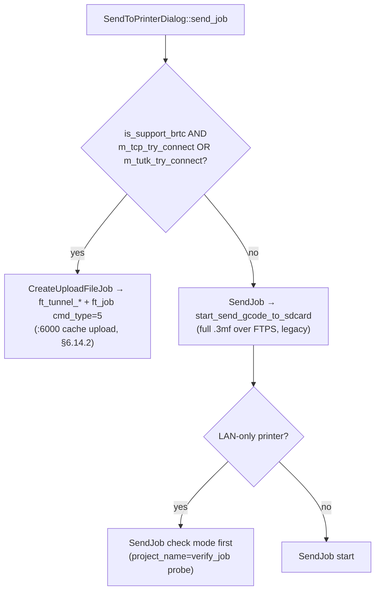
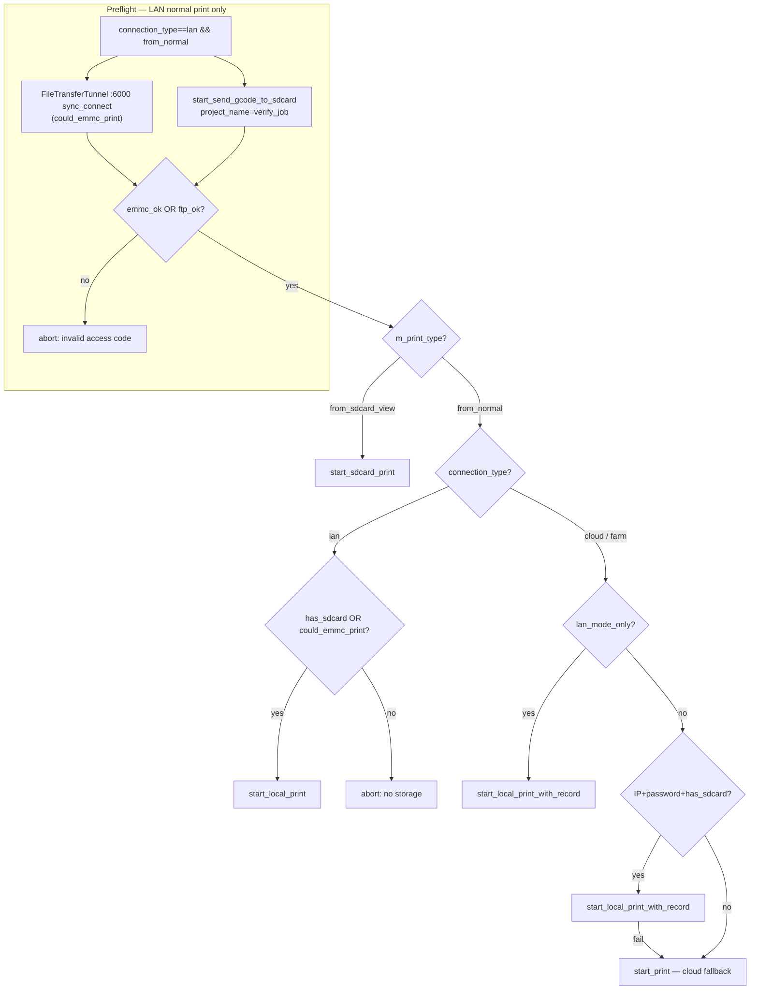

### 6.8. Submitting a print job

Types:
- `OnUpdateStatusFn = std::function<void(int status, int code, std::string msg)>`
- `WasCancelledFn   = std::function<bool()>`
- `OnWaitFn         = std::function<bool(int status, std::string job_info)>`

The `PrintParams` struct (`src/slic3r/Utils/bambu_networking.hpp:192-241`) carries these fields: `dev_id`, `task_name`, `project_name`, `preset_name`, `filename`, `config_filename`, `plate_index`, `ftp_folder`, `ftp_file`, `ftp_file_md5`, `nozzle_mapping`, `ams_mapping`, `ams_mapping2`, `ams_mapping_info`, `nozzles_info`, `connection_type`, `comments`, `origin_profile_id`, `stl_design_id`, `origin_model_id`, `print_type`, `dst_file`, `dev_name`, `dev_ip`, `use_ssl_for_ftp`, `use_ssl_for_mqtt`, `username`, `password`, `task_bed_leveling`, `task_flow_cali`, `task_vibration_cali`, `task_layer_inspect`, `task_record_timelapse`, `task_timelapse_use_internal`, `task_use_ams`, `task_bed_type`, `extra_options`, `auto_bed_leveling`, `auto_flow_cali`, `auto_offset_cali`, `extruder_cali_manual_mode`, `task_ext_change_assist`, `try_emmc_print`.

| Symbol | Signature |
|--------|-----------|
| `bambu_network_start_print` | `int(void*, PrintParams, OnUpdateStatusFn, WasCancelledFn, OnWaitFn)` — cloud |
| `bambu_network_start_local_print_with_record` | `int(void*, PrintParams, OnUpdateStatusFn, WasCancelledFn, OnWaitFn)` — LAN + metadata upload |
| `bambu_network_start_send_gcode_to_sdcard` | `int(void*, PrintParams, OnUpdateStatusFn, WasCancelledFn, OnWaitFn)` — FTPS upload of `filename` to printer storage; **destination name = `project_name`** (sanitized). No MQTT print command. See §6.14.3 for Studio callers |
| `bambu_network_start_local_print` | `int(void*, PrintParams, OnUpdateStatusFn, WasCancelledFn)` — LAN only |
| `bambu_network_start_sdcard_print` | `int(void*, PrintParams, OnUpdateStatusFn, WasCancelledFn)` |

Print-job stages — the `SendingPrintJobStage` enum (`bambu_networking.hpp:146-156`): `Create=0, Upload=1, Waiting=2, Sending=3, Record=4, WaitPrinter=5, Finished=6, ERROR=7, Limit=8`.

#### 6.8.0. End-to-end print flows (Studio-side orchestration)

This section documents **what Bambu Studio itself calls** when the user starts a print or upload — not what the stock/open plugin does internally ([STATUS.md §6.8](../STATUS.md#open-plugin-abi--internal-implementation) covers our plugin). All paths below are traced from `PrintJob.cpp`, `SendJob.cpp`, `SendToPrinter.cpp`, and `SelectMachine.cpp` in upstream BambuStudio.

##### UI entry points → worker classes

| User action | Studio dialog / job | `PrintParams.print_type` / notes |
|---|---|---|
| **Slice → Print plate** (normal send) | `SelectMachineDialog` → `PrintJob` | `"from_normal"` |
| **Device → Files → Print** on an existing `.3mf` | `SelectMachineDialog` → `PrintJob` | `"from_sdcard_view"`; `dst_file` = path on printer storage |
| **Send to Printer** (upload to cache/USB, no print) | `SendToPrinterDialog` | **`ft_*`** when `is_support_brtc` + LAN/TUTK tunnel (`SendToPrinter.cpp:947`); else fallback **`SendJob`** → `start_send_gcode_to_sdcard` (FTPS, pre-brtc printers) |
| **Access-code / IP validation** | `PrintJob` preflight, `SendJob` check mode (`ReleaseNote.cpp` IP dialog) | Same ABI with `project_name="verify_job"` and a tiny temp file — see §6.14.3 |

Studio wraps every `bambu_network_start_*` call through `NetworkAgent::{start_print,start_local_print,…}` (`NetworkAgent.cpp:1363-1425`), which forwards to the loaded plugin unchanged.

##### Printer capability flags

Studio does **not** pass these booleans into `PrintParams`. They live on `MachineObject` (and sub-objects like `DevPrintOptions`, `DevAxis`, `DevStorage`), parsed from MQTT `push_status.print` on every status update. They **gate UI and orchestration** before any plugin call.

All bit indices below are zero-based. Hex-string fields (`fun`, `fun2`, `cfg`, `aux`, `stat`) are parsed via `get_flag_bits(hex_str, bit)` which converts the hex string to a 64-bit integer first. Integer fields (`home_flag`, `flag3`, `xcam.cfg`) use direct bit shifts.

###### `print.fun` — hex string, up to 64 bits

Parsed in `DeviceManager.cpp` (`parse_new_info`), `DevPrintOptions.cpp` (`ParseCapabilityV1_0`), and `DevAxis.cpp` (`ParseAxis`).

| Bit | Studio variable | Description |
|-----|-----------------|-------------|
| 1 | `is_support_agora` | Agora-based video streaming; when set, disables `is_support_tunnel_mqtt` |
| 2 | `is_220V_voltage` | Printer operates on 220 V mains (affects bed temp limits) |
| 6 | `is_support_flow_calibration` | Flow-rate calibration support (force-disabled on O-series) |
| 7 | `is_support_pa_calibration` | Pressure-advance calibration support (force-disabled on P-series) |
| 8 | `m_allow_prompt_sound_detection.is_support` | Firmware can toggle completion/error beep |
| 9 | `m_filament_tangle_detection.is_support` | Filament tangle detection capability |
| 10 | `is_support_motor_noise_cali` | Motor vibration compensation / noise calibration |
| 11 | `is_support_user_preset` | Printer can store user presets on-device |
| 12 | `is_support_door_open_check` | Door-open safety check during print |
| 13 | `m_nozzle_blob_detection.is_support` | Nozzle blob / residue detection capability |
| 14 | `is_support_upgrade_kit` | Supports hardware upgrade kit (e.g. P1S+) |
| 28 | `is_support_internal_timelapse` | Internal (eMMC) timelapse storage |
| 31 | `is_support_brtc` | TCP `:6000` file-transfer tunnel (`ft_*` ABI) and `brtc://` URLs |
| 32 | `m_is_support_mqtt_homing` | MQTT-based axis homing command support *(DevAxis)* |
| 38 | `m_is_support_mqtt_axis_ctrl` | MQTT-based manual axis movement *(DevAxis)* |
| 39 | `m_support_mqtt_bet_ctrl` | MQTT-based bed temperature control |
| 40 | `m_calib.support_new_auto_calib` | New auto-calibration flow *(DevCalib)* |
| 42 | `m_spaghetti_detection.is_support` | AI spaghetti detection capability *(DevPrintOptions)* |
| 43 | `m_purgechutepileup_detection.is_support` | Purge-chute pileup detection capability |
| 44 | `m_nozzleclumping_detection.is_support` | Nozzle clumping detection capability |
| 45 | `m_airprinting_detection.is_support` | Air-printing (extrusion in empty space) detection |
| 46 | `SetSupportCoolingFilter` | Cooling filter hardware present *(DevFan)* |
| 48 | `is_support_ext_change_assist` | External spool change assistant |
| 49 | `is_support_partskip` | Part-skip (selective object cancellation) |
| 60 | `SetSupportNozzleRack` | Multi-nozzle rack hardware *(DevNozzleSystem)* |
| 62 | `m_idel_heating_protect_detection.is_support` | Idle heating protection (auto-cooldown) |

Bits not read by Studio: 0, 3–5, 15–27, 29–30, 33–37, 41, 47, 50–59, 61, 63.

###### `print.fun2` — hex string, variable length

Parsed via `get_flag_bits_no_border` which handles arbitrarily long hex strings.

| Bit | Studio variable | Description |
|-----|-----------------|-------------|
| 0 | `is_support_print_with_emmc` | Can print from eMMC without SD card |
| 2 | `m_buildplate_align_detection.is_support` | Buildplate offset alignment detection *(DevPrintOptions)* |
| 3 | `is_support_pa_mode` | Pressure-advance tuning mode |
| 4 | `m_purify_air_at_print_end.is_support` | Air purification after print *(DevPrintOptions)* |
| 5 | `is_support_remote_dry` | Remote filament drying command |
| 6 | `is_support_update_remain_hide_display` | Can hide remaining-time display |
| 7 | `m_firmware_support_print_tpu_left` | TPU-left-in-extruder print support (conditional on printer type) |
| 8 | `is_support_active_arc_fitting` | Arc-fitting (G2/G3) motion planning |
| 13 | `m_fod_check_detection.is_support` | Foreign-object-debris detection *(DevPrintOptions)* |
| 14 | `m_displacement_detection.is_support` | Layer displacement detection *(DevPrintOptions)* |
| 17 | `is_support_model_internal_storage` | Internal model-cache storage tab |
| 19 | `is_support_check_track_switch_match_slice_printer` | AMS track-switch / slicer-printer match check |
| 21–22 | `ams_preload_version` | AMS preload protocol version (2-bit field: 0–3) |

###### `home_flag` — integer (decimal)

A single integer read by three independent parsers. Reported in legacy (non-NP) `push_status`.

**DevAxis** (`DevAxis.h`) — homing state:

| Bit | Field | Description |
|-----|-------|-------------|
| 0 | X homed | X axis is at home position |
| 1 | Y homed | Y axis is at home position |
| 2 | Z homed | Z axis is at home position |

**DevPrintOptions** (`DevPrintOptions.cpp:ParseDetectionV1_0`) — detection toggles:

| Bit | Field | Description |
|-----|-------|-------------|
| 4 | `auto_recovery` current value | Auto-recovery-on-step-loss enabled |
| 17 | `prompt_sound` current value | Completion/error beep enabled |
| 18 | `prompt_sound` is_support | Firmware supports beep toggle |
| 19 | `filament_tangle` is_support | Firmware supports tangle detection |
| 20 | `filament_tangle` current value | Tangle detection enabled |
| 24 | `nozzle_blob` current value | Nozzle blob detection enabled |
| 25 | `nozzle_blob` is_support | Firmware supports blob detection |

**MachineObject** (`DeviceManager.cpp:parse_home_flag`) — capabilities & state:

| Bit | Field | Description |
|-----|-------|-------------|
| 3 | `is_220V_voltage` | 220 V mains (same as `fun` bit 2) |
| 5 | `camera_recording` | Camera is currently recording |
| 7 | AMS detect-remain | AMS remaining-filament detection enabled |
| 8–9 | SD card state | `SdcardState` enum (2-bit field, see below) |
| 10 | AMS auto-refill | AMS automatic filament refill enabled |
| 15 | `is_support_flow_calibration` | Flow calibration support (force-disabled on O-series) |
| 16 | `is_support_pa_calibration` | PA calibration support (force-disabled on P-series) |
| 21 | `is_support_motor_noise_cali` | Motor noise calibration support |
| 22 | `is_support_user_preset` | User-preset storage support |
| 26 | `installed_upgrade_kit` | Upgrade kit physically installed |
| 27 | `is_support_upgrade_kit` | Upgrade kit supported by hardware |
| 28 | `ams_air_print_status` | AMS air-print detection status |
| 29 | `is_support_air_print_detection` | Air-print detection support (disabled for AMS2/AMSHT firmware) |
| 30 | `is_support_agora` | Agora video support (same as `fun` bit 1) |

**`SdcardState` enum** (`DevStorage.h`):

| Value | Name | Meaning |
|-------|------|---------|
| 0 | `NO_SDCARD` | No SD card inserted |
| 1 | `HAS_SDCARD_NORMAL` | SD card present, healthy |
| 2 | `HAS_SDCARD_ABNORMAL` | SD card present, errors detected |
| 3 | `HAS_SDCARD_READONLY` | SD card present, read-only (write-protected or full) |

###### NP (New Protocol) bitmask fields

NP is activated when the printer sends all four hex-string fields: `cfg`, `fun`, `aux`, `stat` in `push_status.print`. When NP is active, legacy integer fields like `home_flag` and `xcam.cfg` are **not** sent; their information is encoded in the NP fields instead. The hex-bitmask nature of all four fields is independently confirmed in [issue #49](https://github.com/ClusterM/open-bambu-networking/issues/49) (symbol-bearing `.so` rodata + live `02.06.00.50` / `02.07` captures).

> **`support_*` capability map — flow→PA mapping quirk.** Alongside the NP bitmasks, `push_status` carries a `support_*` boolean capability map plus AMS per-tray `state`, `DevInf → connection_name`, and a (usually blanked) `dev_signal`. When decoding `support_*`, note that the **flow-calibration** capability and the **pressure-advance (PA)** capability are cross-wired in at least one firmware generation (a `support_flow_*` flag actually gates PA, or vice-versa); do not assume the flag name maps 1:1 to the feature. Flagged in [issue #49](https://github.com/ClusterM/open-bambu-networking/issues/49); decode against live hardware before gating UI on it. `upgrade_state.new_ver_list[]` / `sw_new_ver` are the source `get_printer_firmware` re-synthesises "available update" state from (per-entry shape confirmed in #49).

**`print.cfg`** — hex string, configuration/settings state:

| Bit | Field | Description |
|-----|-------|-------------|
| 0 | AMS detect-on-insert | AMS detects filament on tray insertion |
| 1 | AMS detect-on-powerup | AMS detects filament on power-up |
| 3 | `camera_recording_when_printing` | Camera records during print |
| 4 | camera resolution | 0 = 720p, 1 = 1080p |
| 5 | `camera_timelapse` | Timelapse recording enabled |
| 6 | `tutk_state` | 1 = TUTK disabled |
| 7 | chamber light | 1 = on, 0 = off *(DevLamp)* |
| 8–10 | speed level | Print speed level (3-bit, `DevPrintingSpeedLevel`) *(DevPrintOptions)* |
| 12 | first-layer inspection | First-layer inspector enabled *(DevPrintOptions)* |
| 13–14 | AI monitoring sensitivity | 0 = never halt, 1 = low, 2 = medium, 3 = high *(DevPrintOptions)* |
| 15 | AI monitoring | AI print monitoring enabled *(DevPrintOptions)* |
| 16 | auto recovery | Auto recovery on step-loss enabled *(DevPrintOptions)* |
| 17 | AMS detect-remain | AMS remaining-filament detection enabled |
| 18 | AMS auto-refill | AMS automatic refill enabled |
| 19 | `xcam__save_remote_print_file_to_storage` | Save cloud-print file to local storage |
| 20–21 | `xcam_door_open_check` | Door-open check state (2-bit, `DoorOpenCheckState`) |
| 22 | prompt sound | Completion/error beep enabled *(DevPrintOptions)* |
| 23 | filament tangle | Tangle detection enabled *(DevPrintOptions)* |
| 24 | nozzle blob | Nozzle blob detection enabled *(DevPrintOptions)* |
| 25 | `installed_upgrade_kit` | Upgrade kit installed |
| 32–33 | idle heating protect | Idle heating protection level (2-bit) *(DevPrintOptions)* |
| 36–37 | purify air | Air purification after print (2-bit) *(DevPrintOptions)* |
| 38–39 | snapshot detection | Snapshot detection state (2-bit) *(DevPrintOptions)* |
| 42 | `is_support_liveview_preview` | Liveview preview image support |

**`print.aux`** — hex string, auxiliary state:

| Bit | Field | Description |
|-----|-------|-------------|
| 12–13 | SD card state | `SdcardState` enum (2-bit, same values as `home_flag` bits 8–9) |
| 26 | `m_has_timelapse_kit` | External timelapse hardware kit present |

**`print.stat`** — hex string, runtime status:

| Bit | Field | Description |
|-----|-------|-------------|
| 7 | `camera_recording` | Camera is currently recording |
| 36 | lamp close recheck | Chamber light close-recheck flag *(DevLamp)* |

###### `print.flag3` — integer (decimal)

| Bit | Studio variable | Description |
|-----|-----------------|-------------|
| 3 | `is_support_filament_setting_inprinting` | Filament settings editable mid-print |
| 9 | `is_enable_ams_np` | AMS New Protocol enabled |
| 10–12 | E3D flow type | Nozzle flow-type indicator (3-bit, passed to `DevNozzleSystemParser`) |
| 13 | `is_support_fila_change_abort` | Filament-change abort command supported |
| 16 | `is_support_ext_change_assist_old` | External spool change assistant (legacy flag, see also `fun` bit 48) |
| 17 | `is_support_filament_32_colors` | 32-color filament mapping support |

###### `print.xcam.cfg` — integer (decimal, **not** hex)

AI detection settings with per-feature enable + sensitivity. Only present in legacy (non-NP) payloads. Each detection feature uses a 1-bit enable followed by a 2-bit sensitivity level.

| Bit | Field | Description |
|-----|-------|-------------|
| 7 | spaghetti enable | Spaghetti detection on/off |
| 8–9 | spaghetti sensitivity | 0 = low, 1 = medium, 2 = high |
| 10 | pileup enable | Purge-chute pileup detection on/off |
| 11–12 | pileup sensitivity | 0 = low, 1 = medium, 2 = high |
| 13 | clumping enable | Nozzle clumping detection on/off |
| 14–15 | clumping sensitivity | 0 = low, 1 = medium, 2 = high |
| 16 | air-print enable | Air-printing detection on/off |
| 17–18 | air-print sensitivity | 0 = low, 1 = medium, 2 = high |
| 20 | buildplate align | Buildplate offset alignment on/off |
| 21 | FOD check | Foreign-object-debris check on/off |
| 22 | displacement | Layer displacement detection on/off |

When `xcam.cfg` is present, `m_ai_monitoring_detection.is_support_detect` is set to `true` unconditionally. Legacy protocol also reads `xcam.printing_monitor` (bool) and even older `xcam.spaghetti_detector` (bool) + `xcam.print_halt` (bool) as fallbacks.

Other legacy `xcam.*` JSON fields:

| Field | Type | Description |
|-------|------|-------------|
| `xcam.halt_print_sensitivity` | string | AI monitoring sensitivity override (`"low"` / `"medium"` / `"high"`) |
| `xcam.first_layer_inspector` | bool | First-layer inspector enabled |
| `xcam.buildplate_marker_detector` | bool | Buildplate marker detection (also sets `is_support_detect`) |

###### `ipcam.*` — camera configuration (JSON object)

| Field | Type | Description |
|-------|------|-------------|
| `ipcam.ipcam_record` | string | `"enable"` / `"disable"` — record during print |
| `ipcam.timelapse` | string | `"enable"` / `"disable"` — timelapse recording |
| `ipcam.ipcam_dev` | string | `"1"` = camera present |
| `ipcam.resolution` | string | Current resolution (`"720p"`, `"1080p"`) |
| `ipcam.resolution_supported` | string[] | List of supported resolutions |
| `ipcam.liveview.local` | string | `"none"` / `"disabled"` / `"local"` / `"rtsps"` / `"rtsp"` |
| `ipcam.liveview.remote` | string | `"none"` / `"tutk"` / `"agora"` / `"tutk_agaro"` |
| `ipcam.file.local` | string | `"none"` / `"local"` |
| `ipcam.file.remote` | string | `"none"` / `"tutk"` / `"agora"` / `"tutk_agaro"` |
| `ipcam.file.model_download` | string | `"enabled"` / `"disabled"` |
| `ipcam.virtual_camera` | string | `"enabled"` / `"disabled"` |
| `ipcam.rtsp_url` | string | Local RTSP URL (overrides `liveview.local` when present) |
| `ipcam.tutk_server` | string | TUTK server state (`"disable"` etc.) |

###### `lights_report[]` — chamber light state (JSON array)

Each entry has `node` (string) and `mode` (string). Studio reads `node == "chamber_light"` and parses `mode` as `"on"` / `"off"` / `"flashing"`.

###### `online.*` — connectivity state (JSON object)

| Field | Type | Description |
|-------|------|-------------|
| `online.ahb` | bool | AHB (cloud heartbeat) connected |
| `online.rfid` | bool | RFID reader online |
| `online.version` | int | Online protocol version number |

###### `hms[]` — Health Management System (JSON array)

Each entry has `attr` (unsigned int) and `code` (unsigned int).

**`attr` bitmask:**

| Bits | Field | Description |
|------|-------|-------------|
| 31–24 | `module_id` | Module identifier (`ModuleID` enum, 0x00–0x0F) |
| 23–16 | `module_num` | Module instance number |
| 15–8 | `part_id` | Part identifier within module |
| 7–0 | `reserved` | Reserved |

**`code` bitmask:**

| Bits | Field | Description |
|------|-------|-------------|
| 31–16 | `msg_level` | `HMSMessageLevel`: 1 = Fatal, 2 = Serious, 3 = Common, 4 = Info |
| 15–0 | `msg_code` | Error/warning code |

**`ModuleID` enum values:** 0x03 = MC, 0x05 = Mainboard, 0x07 = AMS, 0x08 = TH, 0x0C = XCam.

The long error code is formatted as `MMNNPPRRLLCCCC` (hex) where MM = module_id, NN = module_num, PP = part_id, RR = reserved, LL = msg_level, CCCC = msg_code.

###### `upgrade_state.*` — firmware upgrade (JSON object)

Studio reads `upgrade_state.ams_new_version_number` (string, not used in NP mode) and `upgrade_state.ahb_new_version_number` (string) to detect available firmware updates. Detailed upgrade parsing is handled by `DevUpgrade`.

###### `support_*` JSON booleans

These are standalone JSON fields in `push_status.print`, separate from the bitmask fields. They provide an alternative way for firmware to advertise capabilities (some overlap with `fun`/`fun2`/`home_flag` bits).

| JSON field | Studio variable | Description |
|------------|-----------------|-------------|
| `support_tunnel_mqtt` | `is_support_tunnel_mqtt` | MQTT tunnel for video (disabled when `is_support_agora` is set) |
| `support_flow_calibration` | `is_support_pa_calibration` | **Note:** despite the name, Studio writes this to `is_support_pa_calibration` (probable naming error) |
| `support_send_to_sd` | `is_support_send_to_sdcard` | "Send to Printer" feature available |
| `support_filament_backup` | `is_support_filament_backup` | Filament backup/spool-data storage |
| `support_update_remain` | `is_support_update_remain` | Remaining-time update display (force-enabled for AMS2/AMSHT) |
| `support_bed_leveling` | `is_support_bed_leveling` | Bed leveling calibration (int, not bool) |
| `support_ams_humidity` | `is_support_ams_humidity` | AMS humidity display |
| `support_1080dpi` | `is_support_1080dpi` | 1080p camera resolution |
| `support_cloud_print_only` | `is_support_cloud_print_only` | Printer only accepts cloud prints |
| `support_command_ams_switch` | `is_support_command_ams_switch` | AMS switch MQTT command |
| `support_mqtt_alive` | `is_support_mqtt_alive` | MQTT keep-alive mechanism |
| `support_motor_noise_cali` | `is_support_motor_noise_cali` | Motor noise calibration |
| `support_timelapse` | `is_support_timelapse` | Timelapse recording |
| `support_user_preset` | `is_support_user_preset` | User preset storage |
| `support_refresh_nozzle` | `is_support_refresh_nozzle` | Nozzle refresh command |
| `support_build_plate_marker_detect` | `m_buildplate_mark_detection.is_support` | Buildplate marker detection *(DevPrintOptions)* |
| `support_build_plate_marker_detect_type` | `m_plate_maker_detect_type` | Buildplate marker detection type (int enum) *(DevPrintOptions)* |
| `support_auto_recovery_step_loss` | `m_auto_recovery_detection.is_support` | Auto-recovery on step loss *(DevPrintOptions)* |
| `support_prompt_sound` | `m_allow_prompt_sound_detection.is_support` | Prompt sound toggle *(DevPrintOptions)* |
| `support_filament_tangle_detect` | `m_filament_tangle_detection.is_support` | Filament tangle detection *(DevPrintOptions)* |

###### Notes on overlap and quirks

- **Legacy vs NP duplication:** Some capabilities are reported in both legacy fields and NP fields. For example, `home_flag` bit 3 = `fun` bit 2 = `is_220V_voltage`. When NP is active, `home_flag` is not sent; the same information is encoded in `cfg`/`aux`/`stat` instead.
- **`support_flow_calibration` naming error:** The JSON field `support_flow_calibration` is mapped to `is_support_pa_calibration` in Studio, not `is_support_flow_calibration`. This appears to be a copy-paste error that was never corrected.
- **Series-specific overrides:** `is_support_flow_calibration` is force-disabled for O-series (H2D), and `is_support_pa_calibration` is force-disabled for P-series, regardless of what the firmware reports.
- **AMS firmware overrides:** `is_support_air_print_detection` is force-disabled when AMS2/AMSHT firmware is active. `is_support_update_remain` is force-enabled for the same firmware.

**What "brtc" means here.** In Studio sources the name covers two layers that appeared together (~2025-10, commits `76e45bde2` / `662b7fdac`, §6.14.3):

1. **Upload wire** — `FileTransferTunnel` / `ft_tunnel_*` on TCP port **`:6000`** (LAN IP or TUTK relay), chunked `cmd_type=5` (§6.14.2).
2. **Print-start URL** — MQTT `project_file` with `url` like `brtc://emmc/<filename>` so firmware resolves the file in model cache (§6.8.2 **URL schemes**).

P2S-class printers set **`is_support_brtc=true`**; classic LAN printers often do not and keep the FTPS **`SendJob`** fallback.

##### `SendToPrinterDialog` branch (uses `is_support_brtc`, not `PrintJob`)

When the user clicks **Send** in Send to Printer, Studio picks the upload channel **before** any `bambu_network_start_*` call:

On dialog open, brtc printers **prefer TCP/TUTK** over FTP for the connection handshake (`SendToPrinter.cpp:1304-1342`): if `is_support_brtc && !m_ftp_try_connect`, Studio calls `GetConnection()` instead of showing the old FTP-only ready state.

**Contrast with `PrintJob` LAN preflight** (`PrintJob.cpp:224-252`): always runs **`start_send_gcode_to_sdcard(verify_job)`** (FTPS write probe). Optionally **also** opens a `:6000` tunnel when `could_emmc_print` (`is_support_print_with_emmc`), but that flag is independent of `is_support_brtc`. Normal slice→print ends in **`start_local_print`** / hybrid cloud paths — **not** the Send-to-Printer `ft_*` pipeline (see decision tree below).

##### Decision tree: `PrintJob::process()` (`PrintJob.cpp:149-624`)

**Note:** The Send-to-Printer mermaid above is upload-only. Print jobs use the tree below. Studio sets `try_emmc_print = could_emmc_print` for **every** print path the same way; which LAN transport the **stock plugin** then uses for the model body is decided **inside the plugin by ABI entry point**, not by that flag alone (wire-confirmed 2026-07 — see §6.8.1.2).

After `SelectMachineDialog::on_send_print()` exports the plate `.3mf` (and, for cloud-bound printers, a config `.3mf`), it fills `PrintParams` and starts the background `PrintJob`.

**`connection_type` is not “LAN reachable”.** It is the printer’s own mode advertisement, carried in the SSDP header `devconnect.bambu.com` and forwarded by the plugin as `connect_type` (`src/ssdp.cpp` → `DeviceManager::on_machine_alive`). Studio stores it on `MachineObject` (`DevInfo::SetConnectionType`); `connection_type()` / `is_lan_mode_printer()` just read that field (`DevInfo.cpp`).

| Value | Meaning | Typical Studio behaviour when printing |
|---|---|---|
| `"lan"` | Printer is in **LAN Only Mode** (cloud disabled on the device) | Opens LAN MQTT via `connect_printer`; print via `start_local_print` |
| `"cloud"` | Printer is cloud-paired / not in LAN Only | Selects device via `set_user_selected_machine`; print prefers `start_local_print_with_record` when LAN credentials exist, else `start_print` |
| `"farm"` | Farm mode (treated like LAN for path selection; SSDP may rewrite farm→lan) | Same family as LAN |

A cloud-paired printer can still be on the same LAN (SSDP IP + access code known) while `connection_type` remains `"cloud"`. Access code does **not** set `connection_type` — it only enables LAN MQTT/FTPS/:6000 once Studio (or the plugin) decides to use the LAN channel.

**Inputs Studio fills into `PrintJob` before the tree above** (`SelectMachine.cpp:3133-3178`):

| Field | Source | Role in the tree |
|---|---|---|
| `connection_type` | `MachineObject::connection_type()` (SSDP / bind) | Top-level LAN vs cloud branch |
| `cloud_print_only` | MQTT/capability `support_cloud_print_only` | Forces pure `start_print` (skips LAN-with-record) |
| `has_sdcard` | `DevStorage::HAS_SDCARD_NORMAL` | Required for LAN-with-record upload storage |
| `could_emmc_print` | `is_support_print_with_emmc` | Allows pure LAN print without SD; copied into `try_emmc_print` for the plugin |
| `dev_ip` / `password` | SSDP IP + access code (UI / cloud `dev_access_code`) | Without both, Studio skips LAN-with-record |
| `lan_mode_only` | Studio `app_config` | Force LAN-with-record even for cloud-typed devices |

**ABI entry points the tree resolves to:**

1. `bambu_network_start_local_print` — pure LAN (`connection_type=="lan"`). No cloud `/my/task`.
2. `bambu_network_start_local_print_with_record` — hybrid / “LAN with cloud record” (`mode=lan_file` on `/my/task`). Used for cloud-typed printers when IP+code+storage are available.
3. `bambu_network_start_print` — pure cloud (`mode=cloud_file`). Either immediately (missing LAN prerequisites / `cloud_print_only`) or as Studio’s **own** fallback when `_with_record` returns `< 0`.

##### Three upload/print channels Studio actually uses

| Channel | Who calls it | Upload transport | Print start | Starts a print? |
|---|---|---|---|:---:|
| **`bambu_network_start_*`** | `PrintJob` (print paths), `SendJob` (Send-to-Printer fallback only) | Inside plugin (stock: S3 ± FTPS / `:6000` by entry point — §6.8.1.2) | Pure LAN: plugin MQTT `project_file`. Cloud / hybrid: `POST /my/task` (cloud dispatch); upload-only / probe: none | PrintJob yes; SendJob / verify_job no |
| **`ft_*` ABI** | `SendToPrinterDialog`, `FileTransferTunnel` in `PrintJob` preflight | Studio → `ft_tunnel_*` + `ft_job_create` / `ft_tunnel_start_job` (`FileTransferUtils.cpp`) | **Never** — upload completes with `get_send_finished_event()` | No |
| **`bambu_network_send_message_to_printer`** | `MachineObject::publish_json()` | N/A (opaque JSON passthrough) | Timelapse preflight, AMS queries, user commands — **not** the print job itself | No |

**Important:** On **brtc-capable** printers (P2S, etc.) the **Send to Printer** dialog uploads the `.3mf` via **`ft_*` `cmd_type=5`** when `MachineObject::is_support_brtc` and the dialog connected over LAN TCP or TUTK (`SendToPrinter.cpp:947-962`). That path does not call `start_send_gcode_to_sdcard` for the model. **`start_send_gcode_to_sdcard`** is still the FTPS upload ABI; on current Studio it is mostly invoked with **`project_name="verify_job"`** (write probe) plus a rare **`SendJob` fallback** when `!is_support_brtc` (`SendToPrinter.cpp:977-1027`). The plugin must **not** treat `"verify_job"` as magic — it is only the destination filename Studio set (§6.14.3).

##### Scenario reference

| Scenario | Plugin calls (in order) | Required for firmware to start printing | Tracking / UI only |
|---|---|---|---|
| **LAN print** (`connection_type=="lan"`, normal) | Preflight: optional `:6000` tunnel test + `start_send_gcode_to_sdcard(verify_job)` → **`start_local_print`** | Plugin LAN upload + MQTT `project_file` (§6.8.2). On P2S stock: model over **`:6000`**, URL `brtc://emmc/…` (§6.8.1.2) | Preflight probes; `update_fn` progress |
| **Cloud print** (no LAN credentials) | **`start_print`** | Cloud S3 upload of config + full `.3mf` + `POST /my/task` (`mode=cloud_file`); **cloud** dispatches the print (no LAN model upload) | `wait_fn` waits for `job_id` / printing status; `Record` stage = cloud task metadata |
| **Hybrid** (cloud device + LAN IP/code) | **`start_local_print_with_record`** → on failure **`start_print`** | Stock ABI name is misleading: dual FTPS+S3 upload, final project URL is **S3**, printer **re-downloads from cloud** (`mode=lan_file` — §6.8.1 / §6.8.1.2). Not a real LAN print. | `wait_fn`; Studio download % after start; `params.comments` on fallback |
| **`lan_mode_only` config** | **`start_local_print_with_record`** only | Same hybrid path as above | Same as hybrid |
| **Print existing file** (`from_sdcard_view`) | **`start_sdcard_print`** | MQTT `project_file` with `url=file:///<path>` | UI labels it “cloud service” but plugin call is the same ABI |
| **Upload only** (Send to Printer, brtc printers) | `ft_tunnel_*` + `ft_job` **`cmd_type=7`** → **`cmd_type=5`** | Nothing | Progress via `ft_job` `msg_cb` |
| **Upload only** (Send to Printer, **no** `is_support_brtc`) | `verify_job` probe → **`SendJob`** → **`start_send_gcode_to_sdcard`** (full `.3mf` over FTPS) | Nothing | Legacy fallback; not P2S |

##### Before `PrintJob` — Studio-side steps (no print ABI)

These run in `SelectMachineDialog` **before** any `bambu_network_start_*` call:

1. **Export plate `.3mf`** — `Plater::send_gcode()` packs the sliced plate (`on_send_print`, `SelectMachine.cpp:3005`).
2. **Export config `.3mf`** — `Plater::export_config_3mf()` for **non-LAN** printers only (`SelectMachine.cpp:3026`) — feeds cloud `create_task` / project APIs inside `start_print` / `_with_record`.
3. **AMS / nozzle mapping** — MQTT queries on `MachineObject` (e.g. `get_auto_nozzle_mapping`); results copied into `PrintParams.ams_mapping*` / `nozzle_mapping`. Not part of the print-plugin ABI.
4. **Timelapse storage preflight** (optional) — when timelapse is enabled and `is_support_internal_timelapse`, Studio sends `camera.ipcam_get_media_info` via **`bambu_network_send_message_to_printer`** (LAN) or **`bambu_network_send_message`** (cloud) **before** `on_send_print()` (§6.8.3). Failure or timeout → print proceeds anyway.

##### Callback contract Studio passes into every print job

All five `bambu_network_start_*` symbols share the same callback typedefs (§6.8 above). Studio builds them in `PrintJob::process()` (`PrintJob.cpp:405-548`):

| Callback | Passed to | Purpose |
|---|---|---|
| **`OnUpdateStatusFn update_fn`** | All print paths except `verify_job` preflight (`nullptr`) | Drive progress bar + status text. **`stage`** = `SendingPrintJobStage`; **`code`** = 0–100 upload percent when `stage==Upload` or `Record`; negative / `>100` = error code (`BAMBU_NETWORK_ERR_*`). **`info`** = auxiliary string (upload size hint, or countdown seconds on `Finished`). |
| **`WasCancelledFn cancel_fn`** | All paths that show cancel | Polls `PrintJob::was_canceled()`. Plugin must abort and return `BAMBU_NETWORK_ERR_CANCELED`. |
| **`OnWaitFn wait_fn`** | **`start_print`**, **`start_local_print_with_record`** only | **Not** passed to `start_local_print`, `start_sdcard_print`, or `start_send_gcode_to_sdcard`. After plugin returns success, plugin may invoke `wait_fn(state, job_info_json)`; Studio parses `job_id` and polls **`MachineObject::job_id_`** / **`print_status`** for up to `PRINT_JOB_SENDING_TIMEOUT` seconds (`PrintJob.cpp:497-547`). Pure LAN print skips this — Studio navigates away on `Finished` alone. |

**Stage → progress bar mapping** (`PrintJob.cpp:392-399`): `Create=20%`, `Upload=30%`, `Waiting=70%`, `Record=75%`, `Sending=97%`, `Finished=100%`. Upload/Record sub-percent interpolates from `code`.

**Success contract:** plugin returns `0` and fires `update_fn(PrintingStageFinished, 0, "<seconds>")` where `<seconds>` is the post-send countdown (stock uses `"3"`). Studio then posts `get_print_finished_event()` and jumps to the device page.

##### After the job — monitoring (separate from print submission)

Print submission and ongoing status are **different ABI groups**:

| Need | Studio mechanism | Plugin ABI |
|---|---|---|
| Live progress, temperatures, HMS | `MachineObject` state updated from MQTT **`push_status`** | **`bambu_network_connect_printer`** + **`set_on_printer_connected_fn`** / **`set_on_message_fn`** (LAN), or cloud **`set_user_message_fn`** + implicit subscribe from **`get_user_print_info`** |
| Match cloud task to printer | `wait_fn` + `job_id_` from `push_status` | Only during `start_print` / `_with_record` |
| Thumbnail / subtask panel | **`bambu_network_get_subtask_info`** | After print starts; unrelated to `start_*` return |
| Cancel / pause | `MachineObject::command_task_*` → **`send_message_to_printer`** | Not via print-job API |

The LAN MQTT session is opened through **`connect_printer`** — not inside `PrintJob` — and `project_file` is published on that **already-connected** session (`send_message_to_printer` under the hood on LAN). This is not limited to LAN-Only devices: for a **cloud-paired** printer the stock stack still brings up a LAN session (using the IP from SSDP and the `dev_access_code` fetched from the cloud REST API, §6.4.1), which is the same session the LAN-priority report subscription in §6.3 uses. So "has a LAN session" and "is cloud-paired" are orthogonal — a cloud device can have both transports live at once.

##### `PrintParams` fields Studio sets vs what the plugin must consume

Studio fills `PrintParams` in `PrintJob::process()` (`PrintJob.cpp:214-386`) from the select-machine dialog checkboxes and `MachineObject` capabilities. Fields that **directly affect the print wire** end up in MQTT `project_file` (§6.8.2) or the cloud REST bodies (§6.8.1). Fields Studio sets but **does not embed in `project_file`**: `nozzles_info`, `ams_mapping_info`, `extra_options`, `task_ext_change_assist`, `try_emmc_print`, `comments` — they feed cloud task creation or diagnostics only.

Notable `PrintParams` cases:

- **`project_name="verify_job"`** — Studio's name for the FTPS write probe (`PrintJob.cpp:236`, `SendJob.cpp:134`). Same ABI as any other upload; not a separate plugin code path.
- **`print_type=="from_sdcard_view"`** — sets **`dst_file`** instead of local **`filename`**; triggers **`start_sdcard_print`** only.
- **`ftp_folder`** — passed through but **never assigned by Studio** in the public tree (`PrintJob.cpp:256` reads `obj_->get_ftp_folder()` which is usually empty); stock plugin uploads to FTPS root when empty.
- **`try_emmc_print` / `could_emmc_print`** — Studio copies `could_emmc_print` into `try_emmc_print` for **all** print paths and uses it to gate the `:6000` **preflight** tunnel test. It does **not** appear on the MQTT wire. Stock’s choice of FTPS vs `:6000` for the **model body** is not “`try_emmc_print` ⇒ brtc”; it follows the ABI entry point (§6.8.1.2).

Open-plugin mapping of each ABI entry point: [STATUS.md §6.8 — Open plugin: ABI → internal implementation](../STATUS.md#open-plugin-abi--internal-implementation).

