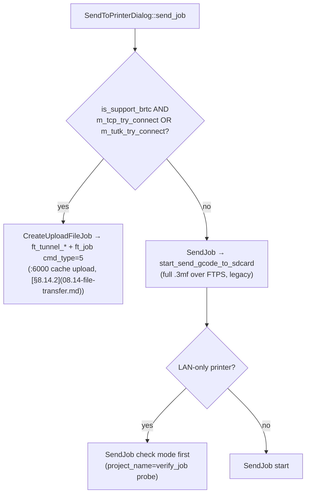
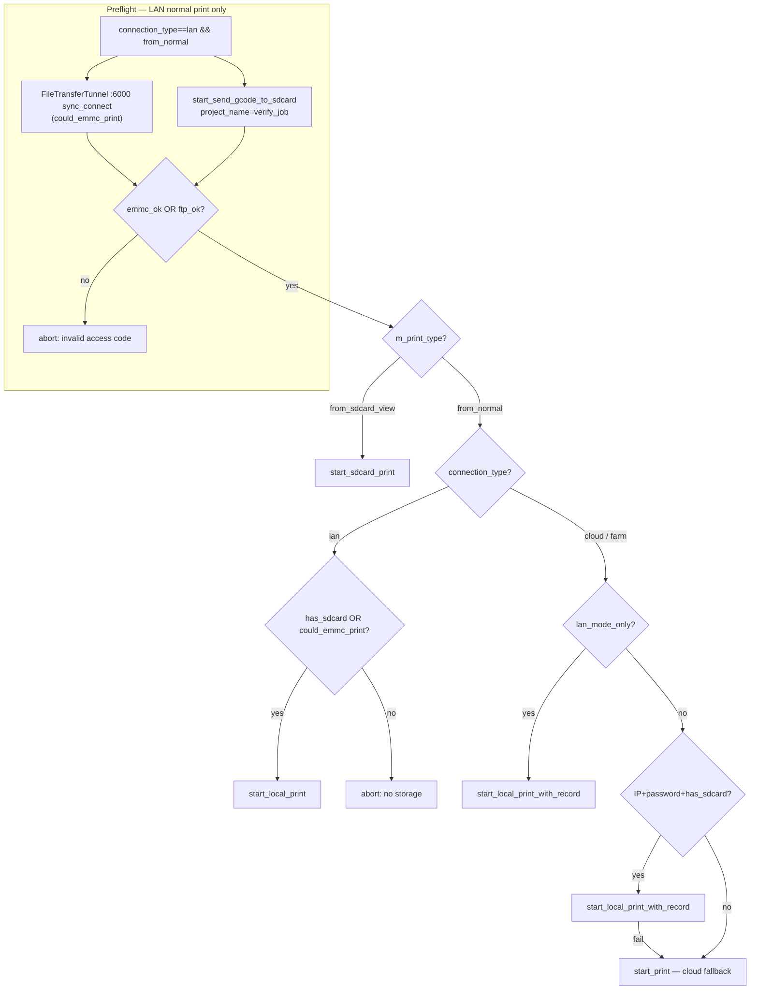

### 11.1. Studio-side orchestration (end-to-end print flows)

This section documents **what Bambu Studio itself calls** when the user starts a print or upload. All paths below are traced from `PrintJob.cpp`, `SendJob.cpp`, `SendToPrinter.cpp`, and `SelectMachine.cpp` in upstream BambuStudio.

##### UI entry points → worker classes

| User action | Studio dialog / job | `PrintParams.print_type` / notes |
|---|---|---|
| **Slice → Print plate** (normal send) | `SelectMachineDialog` → `PrintJob` | `"from_normal"` |
| **Device → Files → Print** on an existing `.3mf` | `SelectMachineDialog` → `PrintJob` | `"from_sdcard_view"`; `dst_file` = path on printer storage |
| **Send to Printer** (upload to cache/USB, no print) | `SendToPrinterDialog` | **`ft_*`** when `is_support_brtc` + LAN/TUTK tunnel (`SendToPrinter.cpp:947`); else fallback **`SendJob`** → `start_send_gcode_to_sdcard` (FTPS, pre-brtc printers) |
| **Access-code / IP validation** | `PrintJob` preflight, `SendJob` check mode (`ReleaseNote.cpp` IP dialog) | Same ABI with `project_name="verify_job"` and a tiny temp file — see [§8.14.3](08.14-file-transfer.md) |

Studio wraps every `bambu_network_start_*` call through `NetworkAgent::{start_print,start_local_print,…}` ([NetworkAgent.cpp:1158-1195](https://github.com/bambulab/BambuStudio/blob/12f17b06f4f537f9c03162d08bb70cf733c42839/src/slic3r/Utils/NetworkAgent.cpp#L1158-L1195)), which forwards to the loaded plugin unchanged.

##### Printer capability flags

Capability bitmaps that gate UI/orchestration are documented in [§12.5](12.03-push-status-capabilities.md) (`push_status.print.fun` / `fun2` / `home_flag` / …).

##### `SendToPrinterDialog` branch (uses `is_support_brtc`, not `PrintJob`)

When the user clicks **Send** in Send to Printer, Studio picks the upload channel **before** any `bambu_network_start_*` call:

On dialog open, brtc printers **prefer TCP/TUTK** over FTP for the connection handshake (`SendToPrinter.cpp:1304-1342`): if `is_support_brtc && !m_ftp_try_connect`, Studio calls `GetConnection()` instead of showing the old FTP-only ready state.

**Contrast with `PrintJob` LAN preflight** (`PrintJob.cpp:224-252`): always runs **`start_send_gcode_to_sdcard(verify_job)`** (FTPS write probe). Optionally **also** opens a `:6000` tunnel when `could_emmc_print` (`is_support_print_with_emmc`), but that flag is independent of `is_support_brtc`. Normal slice→print ends in **`start_local_print`** / hybrid cloud paths — **not** the Send-to-Printer `ft_*` pipeline (see decision tree below).

##### Decision tree: `PrintJob::process()` (`PrintJob.cpp:149-624`)

**Note:** The Send-to-Printer mermaid above is upload-only. Print jobs use the tree below. Studio sets `try_emmc_print = could_emmc_print` for **every** print path the same way; which LAN transport the **stock plugin** then uses for the model body is decided **inside the plugin by ABI entry point**, not by that flag alone (wire-confirmed 2026-07 — see [§11.2](11.02-cloud-upload.md#1122-stock-print-transports-ftps-vs-brtc-wire-confirmed-p2s-2026-07)).

After `SelectMachineDialog::on_send_print()` exports the plate `.3mf` (and, for cloud-bound printers, a config `.3mf`), it fills `PrintParams` and starts the background `PrintJob`.

**`connection_type` is not “LAN reachable”.** It is the printer’s own mode advertisement, carried in the SSDP header `devconnect.bambu.com` and forwarded by the plugin as `connect_type` (plugin SSDP path → `DeviceManager::on_machine_alive`). Studio stores it on `MachineObject` (`DevInfo::SetConnectionType`); `connection_type()` / `is_lan_mode_printer()` just read that field (`DevInfo.cpp`).

| Value | Meaning | Typical Studio behaviour when printing |
|---|---|---|
| `"lan"` | Printer is in **LAN Only Mode** (cloud disabled on the device) | Opens LAN MQTT via `connect_printer`; print via `start_local_print` |
| `"cloud"` | Printer is cloud-paired / not in LAN Only | Selects device via `set_user_selected_machine`; print prefers `start_local_print_with_record` when LAN credentials exist, else `start_print` |
| `"farm"` | Farm mode (treated like LAN for path selection; SSDP may rewrite farm→lan) | Same family as LAN |

A cloud-paired printer can still be on the same LAN (SSDP IP + access code known) while `connection_type` remains `"cloud"`. Access code does **not** set `connection_type` — it only enables LAN MQTT/FTPS/:6000 once Studio (or the plugin) decides to use the LAN channel.

**Inputs Studio fills into `PrintJob` before the tree above** (`SelectMachine.cpp:3133-3178`):

| Field | Source | Role in the tree |
|---|---|---|
| `connection_type` | `MachineObject::connection_type()` (SSDP / bind) | Top-level LAN vs cloud branch |
| `cloud_print_only` | MQTT/capability `support_cloud_print_only` | Forces pure `start_print` (skips LAN-with-record) |
| `has_sdcard` | `DevStorage::HAS_SDCARD_NORMAL` | Required for LAN-with-record upload storage |
| `could_emmc_print` | `is_support_print_with_emmc` | Allows pure LAN print without SD; copied into `try_emmc_print` for the plugin |
| `dev_ip` / `password` | SSDP IP + access code (UI / cloud `dev_access_code`) | Without both, Studio skips LAN-with-record |
| `lan_mode_only` | Studio `app_config` | Force LAN-with-record even for cloud-typed devices |

**ABI entry points the tree resolves to:**

1. `bambu_network_start_local_print` — pure LAN (`connection_type=="lan"`). No cloud `/my/task`.
2. `bambu_network_start_local_print_with_record` — hybrid / “LAN with cloud record” (`mode=lan_file` on `/my/task`). Used for cloud-typed printers when IP+code+storage are available.
3. `bambu_network_start_print` — pure cloud (`mode=cloud_file`). Either immediately (missing LAN prerequisites / `cloud_print_only`) or as Studio’s **own** fallback when `_with_record` returns `< 0`.

##### Three upload/print channels Studio actually uses

| Channel | Who calls it | Upload transport | Print start | Starts a print? |
|---|---|---|---|:---:|
| **`bambu_network_start_*`** | `PrintJob` (print paths), `SendJob` (Send-to-Printer fallback only) | Inside plugin (stock: S3 ± FTPS / `:6000` by entry point — [§11.2](11.02-cloud-upload.md#1122-stock-print-transports-ftps-vs-brtc-wire-confirmed-p2s-2026-07)) | Pure LAN: plugin MQTT `project_file`. Cloud / hybrid: `POST /my/task` (cloud dispatch); upload-only / probe: none | PrintJob yes; SendJob / verify_job no |
| **`ft_*` ABI** | `SendToPrinterDialog`, `FileTransferTunnel` in `PrintJob` preflight | Studio → `ft_tunnel_*` + `ft_job_create` / `ft_tunnel_start_job` (`FileTransferUtils.cpp`) | **Never** — upload completes with `get_send_finished_event()` | No |
| **`bambu_network_send_message_to_printer`** | `MachineObject::publish_json()` | N/A (opaque JSON passthrough) | Timelapse preflight, AMS queries, user commands — **not** the print job itself | No |

**Important:** On **brtc-capable** printers (P2S, etc.) the **Send to Printer** dialog uploads the `.3mf` via **`ft_*` `cmd_type=5`** when `MachineObject::is_support_brtc` and the dialog connected over LAN TCP or TUTK (`SendToPrinter.cpp:947-962`). That path does not call `start_send_gcode_to_sdcard` for the model. **`start_send_gcode_to_sdcard`** is still the FTPS upload ABI; on current Studio it is mostly invoked with **`project_name="verify_job"`** (write probe) plus a rare **`SendJob` fallback** when `!is_support_brtc` (`SendToPrinter.cpp:977-1027`). The plugin must **not** treat `"verify_job"` as magic — it is only the destination filename Studio set ([§8.14.3](08.14-file-transfer.md)).

##### Scenario reference

| Scenario | Plugin calls (in order) | Required for firmware to start printing | Tracking / UI only |
|---|---|---|---|
| **LAN print** (`connection_type=="lan"`, normal) | Preflight: optional `:6000` tunnel test + `start_send_gcode_to_sdcard(verify_job)` → **`start_local_print`** | Plugin LAN upload + MQTT `project_file` ([§12.1](12.01-project-file.md)). On P2S stock: model over **`:6000`**, URL `brtc://emmc/…` ([§11.2](11.02-cloud-upload.md#1122-stock-print-transports-ftps-vs-brtc-wire-confirmed-p2s-2026-07)) | Preflight probes; `update_fn` progress |
| **Cloud print** (no LAN credentials) | **`start_print`** | Cloud S3 upload of config + full `.3mf` + `POST /my/task` (`mode=cloud_file`); **cloud** dispatches the print (no LAN model upload) | `wait_fn` waits for `job_id` / printing status; `Record` stage = cloud task metadata |
| **Hybrid** (cloud device + LAN IP/code) | **`start_local_print_with_record`** → on failure **`start_print`** | Stock ABI name is misleading: dual FTPS+S3 upload, final project URL is **S3**, printer **re-downloads from cloud** (`mode=lan_file` — [§11.2](11.02-cloud-upload.md) / [§11.2](11.02-cloud-upload.md#1122-stock-print-transports-ftps-vs-brtc-wire-confirmed-p2s-2026-07)). Not a real LAN print. | `wait_fn`; Studio download % after start; `params.comments` on fallback |
| **`lan_mode_only` config** | **`start_local_print_with_record`** only | Same hybrid path as above | Same as hybrid |
| **Print existing file** (`from_sdcard_view`) | **`start_sdcard_print`** | MQTT `project_file` with `url=file:///<path>` | UI labels it “cloud service” but plugin call is the same ABI |
| **Upload only** (Send to Printer, brtc printers) | `ft_tunnel_*` + `ft_job` **`cmd_type=7`** → **`cmd_type=5`** | Nothing | Progress via `ft_job` `msg_cb` |
| **Upload only** (Send to Printer, **no** `is_support_brtc`) | `verify_job` probe → **`SendJob`** → **`start_send_gcode_to_sdcard`** (full `.3mf` over FTPS) | Nothing | Legacy fallback; not P2S |

##### Before `PrintJob` — Studio-side steps (no print ABI)

These run in `SelectMachineDialog` **before** any `bambu_network_start_*` call:

1. **Export plate `.3mf`** — `Plater::send_gcode()` packs the sliced plate (`on_send_print`, `SelectMachine.cpp:3005`).
2. **Export config `.3mf`** — `Plater::export_config_3mf()` for **non-LAN** printers only (`SelectMachine.cpp:3026`) — feeds cloud `create_task` / project APIs inside `start_print` / `_with_record`.
3. **AMS / nozzle mapping** — MQTT queries on `MachineObject` (e.g. `get_auto_nozzle_mapping`); results copied into `PrintParams.ams_mapping*` / `nozzle_mapping`. Not part of the print-plugin ABI.
4. **Timelapse storage preflight** (optional) — when timelapse is enabled and `is_support_internal_timelapse`, Studio sends `camera.ipcam_get_media_info` via **`bambu_network_send_message_to_printer`** (LAN) or **`bambu_network_send_message`** (cloud) **before** `on_send_print()` ([§11.3](11.03-timelapse-preflight.md)). Failure or timeout → print proceeds anyway.

##### Callback contract Studio passes into every print job

All five `bambu_network_start_*` symbols share the same callback typedefs (§8.8 above). Studio builds them in `PrintJob::process()` (`PrintJob.cpp:405-548`):

| Callback | Passed to | Purpose |
|---|---|---|
| **`OnUpdateStatusFn update_fn`** | All print paths except `verify_job` preflight (`nullptr`) | Drive progress bar + status text. **`stage`** = `SendingPrintJobStage`; **`code`** = 0–100 upload percent when `stage==Upload` or `Record`; negative / `>100` = error code (`BAMBU_NETWORK_ERR_*`). **`info`** = auxiliary string (upload size hint, or countdown seconds on `Finished`). |
| **`WasCancelledFn cancel_fn`** | All paths that show cancel | Polls `PrintJob::was_canceled()`. Plugin must abort and return `BAMBU_NETWORK_ERR_CANCELED`. |
| **`OnWaitFn wait_fn`** | **`start_print`**, **`start_local_print_with_record`** only | **Not** passed to `start_local_print`, `start_sdcard_print`, or `start_send_gcode_to_sdcard`. After plugin returns success, plugin may invoke `wait_fn(state, job_info_json)`; Studio parses `job_id` and polls **`MachineObject::job_id_`** / **`print_status`** for up to `PRINT_JOB_SENDING_TIMEOUT` seconds (`PrintJob.cpp:497-547`). Pure LAN print skips this — Studio navigates away on `Finished` alone. |

**Stage → progress bar mapping** (`PrintJob.cpp:392-399`): `Create=20%`, `Upload=30%`, `Waiting=70%`, `Record=75%`, `Sending=97%`, `Finished=100%`. Upload/Record sub-percent interpolates from `code`.

**Success contract:** plugin returns `0` and fires `update_fn(PrintingStageFinished, 0, "<seconds>")` where `<seconds>` is the post-send countdown (stock uses `"3"`). Studio then posts `get_print_finished_event()` and jumps to the device page.

##### After the job — monitoring (separate from print submission)

Print submission and ongoing status are **different ABI groups**:

| Need | Studio mechanism | Plugin ABI |
|---|---|---|
| Live progress, temperatures, HMS | `MachineObject` state updated from MQTT **`push_status`** | **`bambu_network_connect_printer`** + **`set_on_printer_connected_fn`** / **`set_on_message_fn`** (LAN), or cloud **`set_user_message_fn`** + implicit subscribe from **`get_user_print_info`** |
| Match cloud task to printer | `wait_fn` + `job_id_` from `push_status` | Only during `start_print` / `_with_record` |
| Thumbnail / subtask panel | **`bambu_network_get_subtask_info`** | After print starts; unrelated to `start_*` return |
| Cancel / pause | `MachineObject::command_task_*` → **`send_message_to_printer`** | Not via print-job API |

The LAN MQTT session is opened through **`connect_printer`** — not inside `PrintJob` — and `project_file` is published on that **already-connected** session (`send_message_to_printer` under the hood on LAN). This is not limited to LAN-Only devices: for a **cloud-paired** printer the stock stack still brings up a LAN session (using the IP from SSDP and the `dev_access_code` fetched from the cloud REST API, [§10.6](10.06-lan-tls-and-access-codes.md)), which is the same session the LAN-priority report subscription in [§6.2](06.02-mqtt.md) uses. So "has a LAN session" and "is cloud-paired" are orthogonal — a cloud device can have both transports live at once.

##### `PrintParams` fields Studio sets vs what the plugin must consume

Studio fills `PrintParams` in `PrintJob::process()` (`PrintJob.cpp:214-386`) from the select-machine dialog checkboxes and `MachineObject` capabilities. Fields that **directly affect the print wire** end up in MQTT `project_file` ([§12.1](12.01-project-file.md)) or the cloud REST bodies ([§11.2](11.02-cloud-upload.md)). Fields Studio sets but **does not embed in `project_file`**: `nozzles_info`, `ams_mapping_info`, `extra_options`, `task_ext_change_assist`, `try_emmc_print`, `comments` — they feed cloud task creation or diagnostics only.

Notable `PrintParams` cases:

- **`project_name="verify_job"`** — Studio's name for the FTPS write probe (`PrintJob.cpp:236`, `SendJob.cpp:134`). Same ABI as any other upload; not a separate plugin code path.
- **`print_type=="from_sdcard_view"`** — sets **`dst_file`** instead of local **`filename`**; triggers **`start_sdcard_print`** only.
- **`ftp_folder`** — passed through but **never assigned by Studio** in the public tree (`PrintJob.cpp:256` reads `obj_->get_ftp_folder()` which is usually empty); stock plugin uploads to FTPS root when empty.
- **`try_emmc_print` / `could_emmc_print`** — Studio copies `could_emmc_print` into `try_emmc_print` for **all** print paths and uses it to gate the `:6000` **preflight** tunnel test. It does **not** appear on the MQTT wire. Stock’s choice of FTPS vs `:6000` for the **model body** is not “`try_emmc_print` ⇒ brtc”; it follows the ABI entry point ([§11.2](11.02-cloud-upload.md#1122-stock-print-transports-ftps-vs-brtc-wire-confirmed-p2s-2026-07)).
